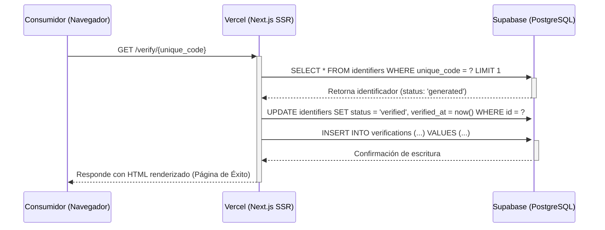
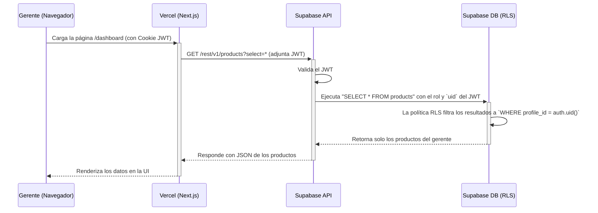

# Diseño de la Arquitectura de Autent-ikapp v2

**Versión:** 1.0
**Autor:** Tony, Codirector Senior

## 1. Principios Arquitectónicos Fundamentales

Esta arquitectura se rige por un conjunto de principios no negociables que garantizan la longevidad, seguridad y mantenibilidad de la plataforma.

-   **Seguridad por Diseño (Security by Design):** La seguridad no es una ocurrencia tardía. La arquitectura se construye sobre un modelo de **confianza cero (Zero Trust)**, donde cada petición es autenticada y autorizada. La capa de datos es privada por defecto y el acceso se concede explícitamente a través de políticas granulares (RLS).
-   **Dominio de Datos Centralizado:** La lógica de negocio y las reglas de integridad de datos residen en la capa más cercana a los datos: la base de datos PostgreSQL. La aplicación frontend actúa como una capa de presentación y orquestación.
-   **Infraestructura Inmutable y Declarativa:** La infraestructura de la base de datos se define a través de migraciones SQL versionables (`Infraestructura como Código`). Esto garantiza entornos consistentes, reproducibles y elimina la deriva de configuración.
-   **Experiencia de Usuario Optimizada:** La arquitectura de frontend utiliza renderizado híbrido (SSR/SSG) para minimizar la latencia percibida por el usuario, especialmente en el flujo crítico de verificación del consumidor.

---

## 2. Vista de Contenedores (Modelo C4)

Este diagrama ilustra los principales bloques de construcción de alto nivel del sistema y sus interacciones.

```mermaid
graph TD
    %% Actores
    actor G as "Gerente de Marca"
    actor C as "Consumidor Final"

    subgraph "Plataforma Autentikapp v2"
        %% Contenedores
        subgraph "Infraestructura de Vercel"
            WebApp[Aplicación Web SPA/SSR<br><br><b>Tecnología:</b> Next.js, React, TypeScript<br><b>Responsabilidad:</b> Provee la UI del dashboard y la página de verificación. Orquesta las llamadas a la API de Supabase.]
        end

        subgraph "Infraestructura de Supabase"
            API[API Gateway<br><br><b>Tecnología:</b> PostgREST<br><b>Responsabilidad:</b> Expone una API RESTful segura sobre la base de datos.]
            Auth[Servicio de Autenticación<br><br><b>Tecnología:</b> Supabase GoTrue<br><b>Responsabilidad:</b> Gestiona la identidad de los usuarios, emisión y validación de JWT.]
            DB[(Base de Datos Relacional<br><br><b>Tecnología:</b> PostgreSQL<br><b>Responsabilidad:</b> Persistencia de datos, integridad referencial y ejecución de la lógica de seguridad (RLS).)]
        end
    end

    %% Relaciones
    G -- "Usa (HTTPS)" --> WebApp
    C -- "Usa (HTTPS)" --> WebApp

    WebApp -- "Autentica vía (HTTPS)" --> Auth
    WebApp -- "Consulta/Muta datos vía (HTTPS)" --> API

    API -- "Ejecuta queries como rol de usuario" --> DB
    Auth -- "Gestiona usuarios y roles" --> DB
```

---

## 3. Modelo de Datos y Estrategia de Seguridad

El esquema de PostgreSQL está diseñado para la normalización y la integridad. La seguridad se aplica directamente en la base de datos.

| Tabla           | Columnas Clave                                                              | Estrategia de Indexación                                     | Política de Seguridad a Nivel de Fila (RLS)                                                                                             |
| :-------------- | :-------------------------------------------------------------------------- | :----------------------------------------------------------- | :-------------------------------------------------------------------------------------------------------------------------------------- |
| **`products`**  | `id (PK)`, `profile_id (FK)`, `name`, `created_at`                          | Índice en `profile_id` para búsquedas rápidas por gerente.    | **`SELECT` / `UPDATE` / `DELETE`:** Permitido solo si `auth.uid() = profile_id`. <br> **`INSERT`:** Permitido, con `profile_id` forzado a `auth.uid()`. |
| **`identifiers`** | `id (PK)`, `product_id (FK)`, `unique_code (UNIQUE)`, `status`, `verified_at` | Índice en `unique_code` para la búsqueda de verificación (crítica). | **`SELECT`:** Permitido si el usuario es dueño del producto asociado. <br> **Público:** La política de verificación permite la lectura pública solo por `unique_code`. |
| **`verifications`** | `id (PK)`, `identifier_id (FK)`, `timestamp`, `geo_location`              | Índice en `identifier_id` para analíticas.                   | **`SELECT`:** Permitido si el usuario es dueño del identificador asociado. <br> **`INSERT`:** Permitido públicamente (desde la función de verificación). |

---

## 4. Diagramas de Secuencia para Flujos Críticos

### a. Flujo de Verificación del Consumidor (Éxito)



### b. Flujo de Carga de Datos del Dashboard (Gerente Autenticado)

