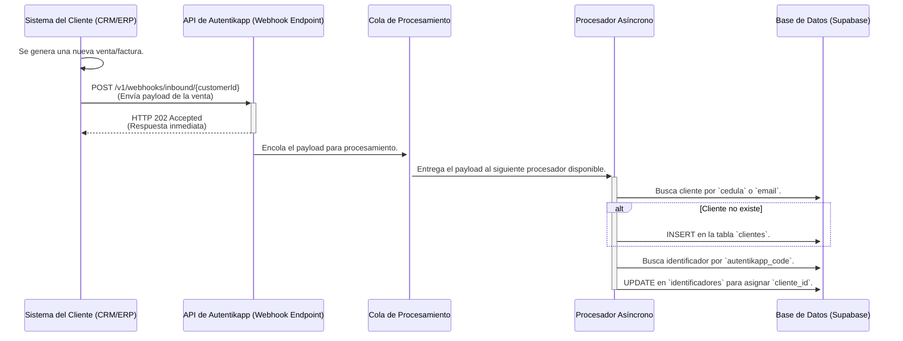

# Guía de Integración por Webhooks de Autentikapp

**Versión:** 1.0
**Audiencia:** Equipo Técnico del Cliente

## 1. Resumen

Esta guía describe cómo integrar su sistema de punto de venta (POS), ERP o CRM con la plataforma Autentikapp para **automatizar la asignación de productos a clientes en el momento de la venta**.

Mediante el uso de webhooks, su sistema puede notificar a Autentikapp cada vez que se realiza una venta que incluye uno de nuestros identificadores únicos. Nuestra plataforma procesará esta información para crear o actualizar la ficha del cliente y vincularla permanentemente al producto vendido, todo ello sin ninguna intervención manual por parte de sus vendedores.

## 2. Flujo de la Integración

El proceso es asíncrono y está diseñado para ser robusto y no afectar el rendimiento de su sistema de ventas.



## 3. Guía de Implementación Técnica

Para configurar la integración, siga estos tres pasos.

### Paso 1: Obtener sus Credenciales

En el dashboard de Autentikapp, vaya a la sección `Configuración > Integraciones > Webhooks`. Allí encontrará dos valores únicos para su cuenta:

-   **Endpoint URL:** La URL a la que su sistema debe enviar las notificaciones.
    -   `https://api.autentik.app/v1/webhooks/inbound/{su_id_de_cliente}`
-   **Clave Secreta (Secret Key):** Un token que se utiliza para verificar que las notificaciones son genuinas.
    -   `whsec_xxxxxxxxxxxxxxxxxxxx`

### Paso 2: Configurar el Webhook en su Sistema

En su software de CRM o facturación, configure un nuevo webhook que se dispare en el evento **"Venta Creada"** o **"Factura Finalizada"**.

-   **Método HTTP:** `POST`
-   **Cabeceras (Headers):**
    -   `Content-Type`: `application/json`
    -   `X-Autentikapp-Signature`: `(ver Paso 3 para la generación de la firma)`

### Paso 3: Especificación del Payload y la Firma

Su sistema debe enviar un cuerpo (body) en formato JSON con la siguiente estructura.

#### a. Estructura del Payload JSON

```json
{
  "event_type": "transaction.created",
  "event_timestamp": "2025-09-13T14:30:00Z", // Formato ISO 8601
  "customer_data": {
    // Requerido al menos uno de los siguientes para identificar al cliente
    "national_id": "123456789", // Cédula o ID Nacional
    "email": "cliente@email.com",
    "phone_number": "+573001234567",

    // Opcional, pero recomendado
    "first_name": "Diego",
    "last_name": "López",
    "whatsapp_number": "+573001234567"
  },
  "transaction_data": {
    "transaction_id": "FACT-00123", // ID de la factura o venta en su sistema
    "currency": "COP",
    "total_amount": 950000.00,
    "line_items": [
      {
        "product_sku": "BOLSO-CUERO-01",
        "product_name": "Bolso de Cuero Edición Limitada",
        "quantity": 1,
        "unit_price": 950000.00,
        // Campo CRÍTICO que vincula la venta con nuestro sistema
        "autentikapp_code": "a1b2c3d4-e5f6-7890-1234-567890abcdef"
      }
      // ...pueden incluirse más items
    ]
  }
}
```

#### b. Generación de la Firma de Seguridad

Para asegurar que las peticiones provienen de su sistema, **debe** incluir la cabecera `X-Autentikapp-Signature`.

El valor de esta cabecera se genera creando un **HMAC-SHA256** del cuerpo del payload JSON (como un string) utilizando su **Clave Secreta** como la clave del HMAC. El resultado debe ser codificado en formato hexadecimal.

**Ejemplo en Pseudocódigo:**
`signature = hmac_sha256(payload_string, su_clave_secreta).to_hex()`

Nuestro servidor realizará el mismo cálculo al recibir la petición. Si las firmas no coinciden, la petición será rechazada con un código `401 Unauthorized`.

## 4. Lógica de Procesamiento en Autentikapp

Una vez que recibimos un webhook válido:

1.  **Validación:** Verificamos la firma `X-Autentikapp-Signature`.
2.  **Respuesta Inmediata:** Devolvemos un `HTTP 202 Accepted` para que su sistema sepa que recibimos el evento, sin esperar a que se procese.
3.  **Procesamiento Asíncrono:**
    -   **Cliente (Upsert):** Buscamos un cliente en su cuenta que coincida con `national_id` o `email`. Si no existe, creamos uno nuevo. Si existe, lo actualizamos con los datos más recientes.
    -   **Identificador:** Buscamos el `autentikapp_code` en nuestra base de datos.
    -   **Asignación:** Vinculamos el identificador con el cliente (`UPDATE identifiers SET cliente_id = ...`).

Este diseño garantiza la máxima fiabilidad y rendimiento para ambos sistemas.
