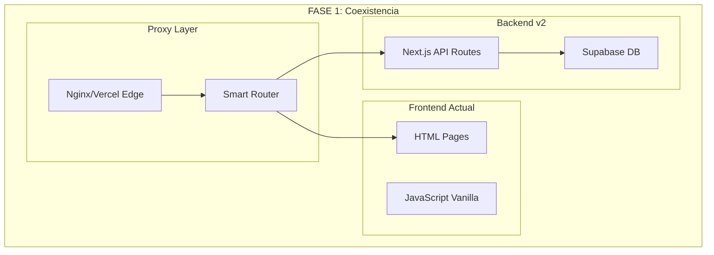
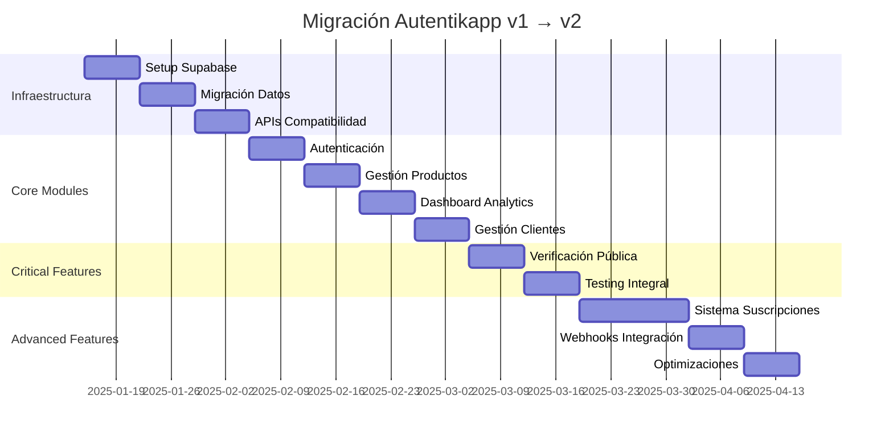

# Estrategia de Migración Autentikapp v1 → v2

**Versión:** 1.0  
**Autor:** Equipo Técnico  
**Fecha:** Enero 2025

## 1. Resumen Ejecutivo

Este documento define la estrategia de migración desde la implementación actual HTML/JavaScript vanilla hacia la arquitectura Next.js/Supabase propuesta en Autentikapp v2, garantizando **continuidad operacional** y **zero downtime** durante la transición.

---

## 2. Análisis del Estado Actual

### Arquitectura Actual
```
src/
├── *.html          # Páginas estáticas
├── js/             # JavaScript vanilla
│   ├── router.js   # Routing client-side
│   ├── dataManager.js # Gestión de datos
│   └── loadSidebar.js # Componentes
├── business.json   # Base de datos JSON
└── styles.css      # Estilos CSS
```

### Funcionalidades Existentes
- Dashboard con analytics básicos
- Gestión de clientes y productos
- Sistema de talleres autorizados
- Verificación de productos via QR
- Router de URLs limpias

---

## 3. Estrategia de Migración: **Estrangulación Progresiva**

Adoptaremos el patrón **Strangler Fig** para migrar módulo por módulo sin interrumpir el servicio.

### Arquitectura de Transición



---

## 4. Plan de Migración por Fases

### **FASE 1: Infraestructura Base (Semanas 1-2)**

#### Objetivos:
- Configurar infraestructura Supabase
- Migrar datos de business.json → PostgreSQL
- Implementar APIs de compatibilidad

#### Entregables:
```
✅ Setup Supabase (auth + database)
✅ Schema PostgreSQL completo
✅ APIs REST compatibles con frontend actual
✅ Migración de datos business.json → DB
```

#### Script de Migración de Datos:
```sql
-- Migración de datos existentes
CREATE TABLE migration_temp AS 
SELECT * FROM json_populate_recordset(
  null::record, 
  '[business.json content]'::json
);

-- Transformación a esquema v2
INSERT INTO products (name, description, profile_id)
SELECT name, description, 'default-user-id'
FROM migration_temp;
```

### **FASE 2: Módulo de Autenticación (Semana 3)**

#### Estrategia:
- Reemplazar sistema de login actual
- Mantener URLs existentes (`/login`)
- Migrar sesiones activas

#### Implementación:
```typescript
// pages/api/auth/compatibility.ts
export default function handler(req, res) {
  // Mantener compatibilidad con sistema actual
  // mientras se migra gradualmente
}
```

### **FASE 3: Módulos Core (Semanas 4-6)**

#### Orden de Migración:
1. **Gestión de Productos** (`/productos`)
2. **Dashboard Analytics** (`/dashboard`) 
3. **Gestión de Clientes** (`/clientes`)

#### Estrategia por Módulo:
```javascript
// Smart Router - Ejemplo
const routeConfig = {
  '/productos': {
    version: 'v2',        // Ya migrado
    component: 'NextJS'
  },
  '/dashboard': {
    version: 'v1',        // Aún en HTML
    component: 'Legacy'
  }
}
```

### **FASE 4: Verificación Pública (Semana 7)**

#### Crítico para el negocio:
- **Zero downtime** en URLs de verificación
- Compatibilidad con QRs existentes
- Preservar analytics de verificaciones

#### Implementación:
```typescript
// pages/verify/[code].tsx
export async function getServerSideProps({ params }) {
  // Verificar en ambos sistemas durante transición
  const legacyResult = await checkLegacySystem(params.code);
  const v2Result = await checkSupabase(params.code);
  
  return {
    props: {
      verification: legacyResult || v2Result
    }
  };
}
```

### **FASE 5: Funcionalidades Avanzadas (Semanas 8-10)**

#### Nuevas Funcionalidades v2:
- Sistema de suscripciones
- Webhooks para integración
- Analytics avanzados
- Gestión de talleres mejorada

---

## 5. Estrategias de Rollback

### Plan de Contingencia por Fase:

| Fase | Rollback Strategy | Recovery Time |
|------|------------------|---------------|
| **Fase 1** | Revertir DNS → HTML original | < 5 min |
| **Fase 2** | Bypass auth v2 → sistema actual | < 2 min |
| **Fase 3** | Router config → rutas legacy | < 1 min |
| **Fase 4** | Dual verification fallback | < 30 seg |

### Monitoreo Crítico:
```yaml
alerts:
  - name: "Migration Health"
    conditions:
      - error_rate > 5%
      - response_time > 2s
      - verification_failures > 1%
    actions:
      - auto_rollback: true
      - notify: "team@autentikapp.com"
```

---

## 6. Preservación de Datos

### Mapeo de Datos business.json → PostgreSQL

```json
// business.json structure
{
  "products": [...],
  "clients": [...],
  "workshops": [...],
  "verifications": [...]
}
```

```sql
-- Target PostgreSQL Schema
CREATE TABLE products (
  id UUID PRIMARY KEY DEFAULT gen_random_uuid(),
  profile_id UUID REFERENCES auth.users(id),
  name VARCHAR NOT NULL,
  description TEXT,
  created_at TIMESTAMPTZ DEFAULT NOW()
);

CREATE TABLE clients (
  id UUID PRIMARY KEY DEFAULT gen_random_uuid(),
  profile_id UUID REFERENCES auth.users(id),
  name VARCHAR NOT NULL,
  email VARCHAR,
  national_id VARCHAR,
  created_at TIMESTAMPTZ DEFAULT NOW()
);
```

### Script de Verificación de Integridad:
```typescript
// Verificar que todos los datos se migraron correctamente
async function verifyMigration() {
  const legacyCount = await countLegacyRecords();
  const v2Count = await countV2Records();
  
  if (legacyCount !== v2Count) {
    throw new Error('Data integrity check failed');
  }
}
```

---

## 7. Testing Strategy durante Migración

### Tipos de Testing:

#### **1. Testing de Compatibilidad**
```javascript
// Verificar que APIs v2 respondan igual que v1
describe('API Compatibility', () => {
  test('GET /api/products matches legacy response', async () => {
    const legacyResponse = await legacyAPI.getProducts();
    const v2Response = await v2API.getProducts();
    
    expect(normalizeResponse(v2Response))
      .toEqual(normalizeResponse(legacyResponse));
  });
});
```

#### **2. Testing de Verificación**
```javascript
// Crítico: Verificar QRs existentes funcionan
describe('QR Verification', () => {
  test('Legacy QR codes still work', async () => {
    const existingQRs = await getLegacyQRCodes();
    
    for (const qr of existingQRs) {
      const result = await verifyQR(qr.code);
      expect(result.status).toBe('valid');
    }
  });
});
```

#### **3. Load Testing**
```yaml
# k6 load testing config
scenarios:
  migration_load:
    executor: ramping-vus
    stages:
      - duration: 2m
        target: 100
      - duration: 10m  
        target: 100
      - duration: 2m
        target: 0
```

---

## 8. Criterios de Éxito

### Métricas Técnicas:
- ✅ **Disponibilidad**: > 99.9% durante migración
- ✅ **Performance**: < 2s tiempo de respuesta
- ✅ **Error Rate**: < 1% errores
- ✅ **Data Integrity**: 100% datos preservados

### Métricas de Negocio:
- ✅ **Verificaciones**: 0% fallos en URLs existentes
- ✅ **Usuarios**: Sin pérdida de sesiones activas
- ✅ **Funcionalidad**: 100% features actuales preservadas

---

## 9. Timeline y Recursos

### Cronograma Detallado:


### Recursos Necesarios:
- **Frontend Developer**: 1 FTE (10 semanas)
- **Backend Developer**: 1 FTE (8 semanas) 
- **DevOps Engineer**: 0.5 FTE (12 semanas)
- **QA Engineer**: 0.5 FTE (6 semanas)

---

## 10. Comunicación y Stakeholders

### Plan de Comunicación:
| Semana | Milestone | Comunicación |
|--------|-----------|--------------|
| 1-2    | Infraestructura lista | Equipo técnico |
| 3      | Autenticación migrada | Usuarios beta |
| 4-6    | Módulos core | Todos los usuarios |
| 7      | Verificación pública | Comunicado público |
| 8-10   | Features avanzadas | Marketing release |

### Rollout Strategy:
1. **Beta Users** (10% tráfico) → Semanas 3-4
2. **Gradual Rollout** (50% tráfico) → Semanas 5-6  
3. **Full Rollout** (100% tráfico) → Semana 7
4. **Legacy Sunset** → Semana 12

---

## 11. Post-Migración

### Actividades de Cleanup (Semanas 11-12):
- Remover código legacy
- Optimizar performance v2
- Documentar lecciones aprendidas
- Preparar roadmap v2.1

### Monitoreo Continuo:
- Métricas de performance
- Error tracking
- User feedback
- Business KPIs

---

**📋 Siguiente Paso**: Revisar y aprobar este plan antes de comenzar la Fase 1 de implementación.