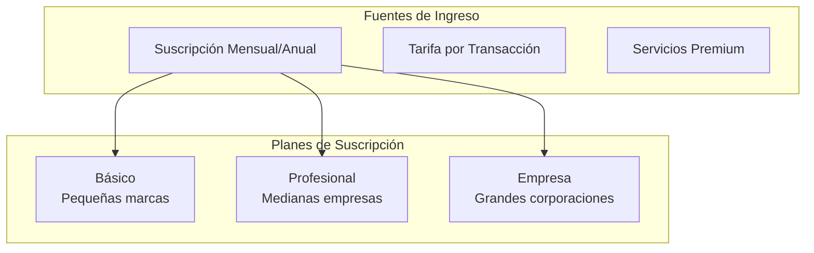

# Sistema de Suscripciones Autentikapp v2

**Versión:** 1.0  
**Autor:** Equipo Técnico  
**Fecha:** Enero 2025

## 1. Resumen Ejecutivo

El sistema de suscripciones es el **núcleo del modelo de negocio** de Autentikapp, implementando un modelo SaaS escalable con múltiples planes, facturación automatizada y restricciones granulares por uso.

---

## 2. Modelo de Negocio Implementado

### Estructura de Ingresos (según Plan de Negocios):



### Planes Definidos:

| Plan | Precio Mensual | QRs Incluidos | Verificaciones/mes | Integraciones |
|------|---------------|---------------|-------------------|---------------|
| **Básico** | $49 USD | 1,000 | 5,000 | Básicas |
| **Profesional** | $199 USD | 10,000 | 50,000 | Webhooks + API |
| **Empresa** | $599 USD | 100,000 | Ilimitadas | Completas + Soporte |

---

## 3. Arquitectura del Sistema

### Modelo de Datos

```sql
-- Planes de Suscripción
CREATE TABLE subscription_plans (
  id UUID PRIMARY KEY DEFAULT gen_random_uuid(),
  name VARCHAR NOT NULL,
  slug VARCHAR UNIQUE NOT NULL,
  price_monthly DECIMAL(10,2) NOT NULL,
  price_yearly DECIMAL(10,2) NOT NULL,
  
  -- Límites del plan
  qr_codes_included INTEGER NOT NULL,
  verifications_monthly INTEGER NOT NULL,
  integrations_enabled BOOLEAN DEFAULT false,
  webhook_support BOOLEAN DEFAULT false,
  priority_support BOOLEAN DEFAULT false,
  
  -- Configuración
  trial_days INTEGER DEFAULT 14,
  is_active BOOLEAN DEFAULT true,
  created_at TIMESTAMPTZ DEFAULT NOW(),
  updated_at TIMESTAMPTZ DEFAULT NOW()
);

-- Suscripciones activas
CREATE TABLE subscriptions (
  id UUID PRIMARY KEY DEFAULT gen_random_uuid(),
  profile_id UUID REFERENCES auth.users(id) NOT NULL,
  plan_id UUID REFERENCES subscription_plans(id) NOT NULL,
  
  -- Estado de la suscripción
  status subscription_status NOT NULL DEFAULT 'active',
  billing_cycle billing_cycle_type NOT NULL DEFAULT 'monthly',
  
  -- Fechas importantes
  trial_ends_at TIMESTAMPTZ,
  current_period_start TIMESTAMPTZ NOT NULL,
  current_period_end TIMESTAMPTZ NOT NULL,
  canceled_at TIMESTAMPTZ,
  
  -- Integración con pasarela de pagos
  external_subscription_id VARCHAR, -- Stripe/PayPal ID
  payment_method_id VARCHAR,
  
  -- Métricas de uso
  qr_codes_used INTEGER DEFAULT 0,
  verifications_used INTEGER DEFAULT 0,
  
  created_at TIMESTAMPTZ DEFAULT NOW(),
  updated_at TIMESTAMPTZ DEFAULT NOW(),
  
  UNIQUE(profile_id) -- Un usuario = una suscripción activa
);

-- Tipos enumerados
CREATE TYPE subscription_status AS ENUM (
  'trial', 'active', 'past_due', 'canceled', 'unpaid'
);

CREATE TYPE billing_cycle_type AS ENUM (
  'monthly', 'yearly'
);

-- Historial de facturación
CREATE TABLE invoices (
  id UUID PRIMARY KEY DEFAULT gen_random_uuid(),
  subscription_id UUID REFERENCES subscriptions(id) NOT NULL,
  
  -- Datos de factura
  invoice_number VARCHAR UNIQUE NOT NULL,
  amount DECIMAL(10,2) NOT NULL,
  currency VARCHAR(3) DEFAULT 'USD',
  tax_amount DECIMAL(10,2) DEFAULT 0,
  
  -- Estado de pago
  status invoice_status NOT NULL DEFAULT 'pending',
  due_date TIMESTAMPTZ NOT NULL,
  paid_at TIMESTAMPTZ,
  
  -- Integración externa
  external_invoice_id VARCHAR, -- Stripe invoice ID
  payment_link VARCHAR,
  
  created_at TIMESTAMPTZ DEFAULT NOW()
);

CREATE TYPE invoice_status AS ENUM (
  'pending', 'paid', 'failed', 'refunded'
);

-- Tracking de uso por período
CREATE TABLE usage_tracking (
  id UUID PRIMARY KEY DEFAULT gen_random_uuid(),
  subscription_id UUID REFERENCES subscriptions(id) NOT NULL,
  period_start TIMESTAMPTZ NOT NULL,
  period_end TIMESTAMPTZ NOT NULL,
  
  -- Métricas de uso
  qr_codes_generated INTEGER DEFAULT 0,
  verifications_processed INTEGER DEFAULT 0,
  api_calls_made INTEGER DEFAULT 0,
  webhook_deliveries INTEGER DEFAULT 0,
  
  created_at TIMESTAMPTZ DEFAULT NOW(),
  
  UNIQUE(subscription_id, period_start)
);
```

---

## 4. API Endpoints del Sistema

### Gestión de Planes

**`GET /api/subscription/plans`**
```json
{
  "data": [
    {
      "id": "basic-plan-id",
      "name": "Básico", 
      "slug": "basic",
      "price": {
        "monthly": 49.00,
        "yearly": 490.00
      },
      "limits": {
        "qrCodes": 1000,
        "verifications": 5000,
        "integrations": false
      },
      "features": [
        "Dashboard de analíticas",
        "Generación de QR códigos",
        "Verificación pública",
        "Soporte por email"
      ]
    }
  ]
}
```

**`POST /api/subscription/subscribe`**
```json
// Request
{
  "planId": "professional-plan-id",
  "billingCycle": "yearly",
  "paymentMethodId": "pm_stripe_payment_method",
  "couponCode": "LAUNCH2025" // opcional
}

// Response 201 Created
{
  "subscription": {
    "id": "sub_xxx",
    "status": "trial",
    "trialEndsAt": "2025-02-15T00:00:00Z",
    "currentPeriodEnd": "2025-03-15T00:00:00Z"
  },
  "invoice": {
    "id": "inv_xxx", 
    "amount": 1990.00,
    "paymentLink": "https://pay.stripe.com/xxx"
  }
}
```

### Gestión de Suscripción Activa

**`GET /api/subscription/current`**
```json
{
  "subscription": {
    "id": "sub_xxx",
    "plan": {
      "name": "Profesional",
      "limits": {
        "qrCodes": 10000,
        "verifications": 50000
      }
    },
    "status": "active",
    "currentPeriodEnd": "2025-03-15T00:00:00Z",
    "usage": {
      "qrCodesUsed": 2543,
      "qrCodesRemaining": 7457,
      "verificationsUsed": 12840,
      "verificationsRemaining": 37160
    },
    "nextInvoice": {
      "amount": 199.00,
      "dueDate": "2025-03-15T00:00:00Z"
    }
  }
}
```

**`PUT /api/subscription/change-plan`**
```json
// Request
{
  "newPlanId": "enterprise-plan-id",
  "billingCycle": "monthly",
  "prorationBehavior": "create_prorations" // immediate_proration | none
}

// Response 200 OK
{
  "subscription": {
    "id": "sub_xxx",
    "plan": "Empresa",
    "status": "active",
    "proration": {
      "credit": -150.00,
      "charge": 599.00,
      "netAmount": 449.00
    }
  }
}
```

### Webhooks de Pagos

**`POST /api/subscription/webhooks/stripe`**
```json
// Stripe webhook events que manejamos
{
  "type": "invoice.payment_succeeded",
  "data": {
    "object": {
      "subscription": "sub_xxx",
      "amount_paid": 19900, // en centavos
      "status": "paid"
    }
  }
}
```

Eventos soportados:
- `invoice.payment_succeeded` → Renovar suscripción
- `invoice.payment_failed` → Marcar como morosa
- `customer.subscription.deleted` → Cancelar suscripción
- `customer.subscription.updated` → Sincronizar cambios

---

## 5. Lógica de Restricciones y Límites

### Middleware de Verificación de Límites

```typescript
// middleware/subscription-limits.ts
export async function checkSubscriptionLimits(
  userId: string,
  action: 'generate_qr' | 'verify_code' | 'api_call'
) {
  const subscription = await getActiveSubscription(userId);
  
  if (!subscription) {
    throw new Error('No active subscription');
  }
  
  const usage = await getCurrentUsage(subscription.id);
  const plan = await getPlan(subscription.planId);
  
  switch (action) {
    case 'generate_qr':
      if (usage.qrCodesUsed >= plan.qrCodesIncluded) {
        throw new SubscriptionLimitError('QR code limit exceeded');
      }
      break;
      
    case 'verify_code':
      if (usage.verificationsUsed >= plan.verificationsMonthly) {
        throw new SubscriptionLimitError('Verification limit exceeded');
      }
      break;
      
    case 'api_call':
      if (!plan.integrationsEnabled) {
        throw new SubscriptionLimitError('API access not included in plan');
      }
      break;
  }
  
  // Incrementar contador de uso
  await incrementUsage(subscription.id, action);
}
```

### Aplicación en Endpoints Críticos

```typescript
// pages/api/products/[productId]/identifiers.ts
export default async function handler(req, res) {
  if (req.method === 'POST') {
    const { quantity } = req.body;
    const userId = await getUserId(req);
    
    // ✅ Verificar límites ANTES de generar QRs
    try {
      for (let i = 0; i < quantity; i++) {
        await checkSubscriptionLimits(userId, 'generate_qr');
      }
    } catch (error) {
      return res.status(402).json({
        error: 'Subscription limit exceeded',
        upgrade_url: `/subscription/upgrade`
      });
    }
    
    // Proceder con la generación
    const identifiers = await generateQRBatch(quantity);
    res.status(202).json({ batchId: identifiers.batchId });
  }
}
```

---

## 6. Integración con Pasarelas de Pago

### Configuración Stripe

```typescript
// lib/stripe.ts
import Stripe from 'stripe';

const stripe = new Stripe(process.env.STRIPE_SECRET_KEY!, {
  apiVersion: '2023-10-16'
});

export async function createSubscription(
  customerId: string,
  priceId: string,
  paymentMethodId: string
) {
  return await stripe.subscriptions.create({
    customer: customerId,
    items: [{ price: priceId }],
    payment_behavior: 'default_incomplete',
    payment_settings: {
      save_default_payment_method: 'on_subscription'
    },
    default_payment_method: paymentMethodId,
    trial_period_days: 14,
    expand: ['latest_invoice.payment_intent']
  });
}
```

### Sincronización de Estados

```typescript
// Webhook handler para mantener sincronía
async function handleStripeWebhook(event: Stripe.Event) {
  switch (event.type) {
    case 'invoice.payment_succeeded':
      const invoice = event.data.object as Stripe.Invoice;
      await renewSubscription(invoice.subscription as string);
      break;
      
    case 'invoice.payment_failed':
      await markSubscriptionPastDue(invoice.subscription as string);
      break;
      
    case 'customer.subscription.updated':
      const subscription = event.data.object as Stripe.Subscription;
      await syncSubscriptionChanges(subscription);
      break;
  }
}
```

---

## 7. Sistema de Prueba Gratuita (Trial)

### Lógica de Trial

```typescript
// Crear nueva suscripción con trial
export async function startTrial(userId: string, planId: string) {
  const trialDays = 14;
  const trialEndsAt = new Date();
  trialEndsAt.setDate(trialEndsAt.getDate() + trialDays);
  
  const subscription = await db.subscriptions.create({
    data: {
      profileId: userId,
      planId: planId,
      status: 'trial',
      trialEndsAt: trialEndsAt,
      currentPeriodStart: new Date(),
      currentPeriodEnd: trialEndsAt
    }
  });
  
  // Configurar job para terminar trial
  await scheduleTrialEndJob(subscription.id, trialEndsAt);
  
  return subscription;
}

// Job automático para finalizar trials
export async function processExpiredTrials() {
  const expiredTrials = await db.subscriptions.findMany({
    where: {
      status: 'trial',
      trialEndsAt: {
        lte: new Date()
      }
    }
  });
  
  for (const trial of expiredTrials) {
    await transitionTrialToSubscription(trial.id);
  }
}
```

---

## 8. Métricas y Analytics del Sistema

### Dashboard de Suscripciones (Admin)

**`GET /api/admin/subscription/metrics`**
```json
{
  "overview": {
    "totalSubscriptions": 1247,
    "activeSubscriptions": 1089,
    "trialSubscriptions": 158,
    "monthlyRecurringRevenue": 89430.00,
    "annualRecurringRevenue": 1073160.00,
    "churnRate": 0.058,
    "averageRevenuePerUser": 82.14
  },
  "planDistribution": {
    "basic": { "count": 743, "revenue": 36407.00 },
    "professional": { "count": 289, "revenue": 57511.00 },
    "enterprise": { "count": 57, "revenue": 34161.00 }
  },
  "usage": {
    "qrCodesGenerated": 2456789,
    "verificationsProcessed": 12890456,
    "averageUtilization": 0.67
  }
}
```

### Métricas por Usuario

```typescript
// Análisis de uso para recomendaciones de upgrade
export async function analyzeUsagePattern(subscriptionId: string) {
  const usage = await getUsageHistory(subscriptionId, 3); // últimos 3 meses
  const plan = await getCurrentPlan(subscriptionId);
  
  const analysis = {
    utilizationRate: usage.averageUsage / plan.limits,
    growthTrend: calculateGrowthTrend(usage.monthly),
    recommendedAction: null
  };
  
  if (analysis.utilizationRate > 0.8) {
    analysis.recommendedAction = 'upgrade';
  } else if (analysis.utilizationRate < 0.3) {
    analysis.recommendedAction = 'downgrade';
  }
  
  return analysis;
}
```

---

## 9. Notificaciones y Comunicación

### Sistema de Alertas Automatizadas

```typescript
// Notificaciones críticas del sistema
const notificationTriggers = {
  // Límite de uso cercano
  usage_warning: {
    trigger: (usage, limits) => usage / limits > 0.8,
    template: 'usage-warning',
    channels: ['email', 'in-app']
  },
  
  // Pago fallido
  payment_failed: {
    trigger: 'webhook:invoice.payment_failed',
    template: 'payment-failed',
    channels: ['email', 'sms'],
    retrySchedule: [1, 3, 7] // días
  },
  
  // Trial por vencer
  trial_ending: {
    trigger: (trialEndsAt) => daysBetween(new Date(), trialEndsAt) <= 3,
    template: 'trial-ending',
    channels: ['email', 'in-app']
  }
};
```

### Templates de Comunicación

```html
<!-- email-templates/usage-warning.hbs -->
<h2>Tu límite mensual se está agotando</h2>
<p>Has usado <strong>{{usagePercentage}}%</strong> de tu plan {{planName}}.</p>

<div class="usage-bar">
  <div class="usage-fill" style="width: {{usagePercentage}}%"></div>
</div>

<p>Considera actualizar a un plan superior para evitar interrupciones.</p>
<a href="{{upgradeUrl}}" class="cta-button">Actualizar Plan</a>
```

---

## 10. Seguridad y Compliance

### Protección contra Fraude

```typescript
// Validaciones de seguridad
export async function validateSubscriptionRequest(req: Request) {
  const userId = await getUserId(req);
  
